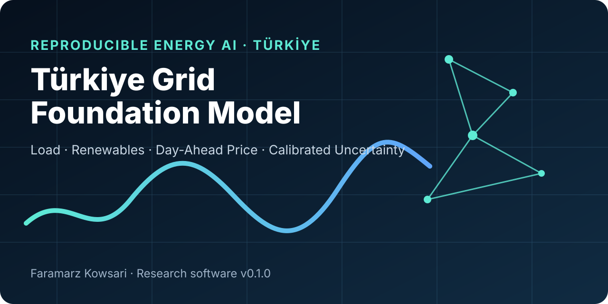
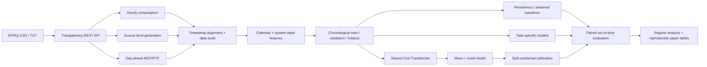

<p align="center">
  
</p>

<p align="center"></p>

<h1 align="center">Türkiye Grid Foundation Model</h1>

<p align="center"><strong>Reproducible multi-task AI for Türkiye's electricity system</strong></p>

<p align="center">
  <a href="https://github.com/FaramarzKowsari/turkiye-grid-foundation-model/actions"></a>
  
  
  
  
  <a href="LICENSE"></a>
</p>

<p align="center">
  <a href="#english">English</a> · <a href="#türkçe">Türkçe</a> · <a href="#español">Español</a> ·
  <a href="docs/researcher-guide.html">Researcher Guide EN · TR · ES</a> · <a href="RESEARCH_PROTOCOL.md">Research protocol</a> · <a href="paper/MANUSCRIPT_DRAFT.md">Paper scaffold</a>
</p>

> **Scientific-status boundary — 23 August 2026:** this repository contains a tested research software scaffold and a proposed experimental design. It does **not** yet contain a completed EPİAŞ research dataset, a frozen confirmatory run, a preregistered hypothesis test, or paper-level empirical results. Synthetic data are used only for CI and pipeline validation. No performance claim is made until a real-data experiment is executed and preserved.

---

<a id="english"></a>
# English

## What this project is

Türkiye Grid Foundation Model is an open research platform for studying whether a single temporal representation can learn useful structure across several coupled signals in Türkiye's electricity system. The first research release is designed around three hourly targets that can be retrieved from the official EPİAŞ Transparency Platform REST services:

1. **real-time electricity consumption** in MWh,
2. **renewable electricity generation** reconstructed from source-level generation fields, and
3. **day-ahead Market Clearing Price (PTF/MCP)** in TRY/MWh.

Instead of training three unrelated forecasting models, the project builds one shared Transformer encoder and asks a stronger scientific question:

> **Does cross-task representation learning improve out-of-time forecasting and uncertainty calibration across load, renewable generation and market price, and under which market regimes does transfer help or hurt?**

The model forecasts each target at **+1 h, +6 h and +24 h**. It produces both a central forecast and a learned scale parameter, then supports post-hoc split-conformal calibration. The repository is deliberately structured so that negative findings can be preserved rather than hidden by repeated tuning.

## Why this can become a paper

A useful paper is not “we trained a Transformer on Turkish electricity data.” The research contribution is the comparison between **joint learning and isolated task learning under chronological regime change**. Electricity demand, renewable output and price are coupled but not identical. Shared representations may help when common temporal structure dominates, yet negative transfer may appear during price shocks, renewable ramps or unusual demand periods.

The planned paper therefore focuses on four questions:

- **RQ1 — Cross-task transfer:** does the shared model improve average predictive skill against persistence, seasonal-naive and task-specific models?
- **RQ2 — Horizon dependence:** is any benefit concentrated at +1 h, +6 h or +24 h?
- **RQ3 — Regime dependence:** when do renewable penetration, high-price periods or sharp demand ramps change the sign of the transfer benefit?
- **RQ4 — Trustworthiness:** are uncertainty intervals calibrated out of time, not merely accurate on average?

A defensible null result is publishable if the experiment is sufficiently well controlled: joint learning may turn out not to outperform strong baselines. This repository treats that as evidence rather than failure.

## Official data layer

The client targets the current EPİAŞ electricity transparency REST service and keeps authentication credentials outside version control. Current implemented endpoints are:

| Dataset | EPİAŞ endpoint | Main fields used |
|---|---|---|
| Real-time consumption | `/v1/consumption/data/realtime-consumption` | `date`, `consumption` |
| Real-time generation | `/v1/generation/data/realtime-generation` | `date`, `sun`, `wind`, `river`, `dammedHydro`, `geothermal`, `biomass`, `total`, thermal sources |
| Day-ahead MCP/PTF | `/v1/markets/dam/data/mcp` | `date`, `price`, optional EUR/USD prices |

The repository does **not** redistribute third-party raw EPİAŞ data by default. `data/raw/` and `data/processed/` are ignored except for placeholders. Researchers retrieve their own copy and preserve provenance metadata for a frozen study release.

### Authentication

EPİAŞ Transparency requests require a TGT header obtained through the EPİAŞ CAS service. Store credentials only in environment variables:

```bash
export EPIAS_USERNAME="..."
export EPIAS_PASSWORD="..."
```

Windows PowerShell:

```powershell
$env:EPIAS_USERNAME="..."
$env:EPIAS_PASSWORD="..."
```

Then fetch a bounded interval:

```bash
python scripts/fetch_epias.py \
  --start "2025-01-01T00:00:00+03:00" \
  --end   "2025-01-31T23:00:00+03:00"
```

For large historical acquisition, date intervals should be chunked and the resulting raw responses hashed before the confirmatory phase. The repository intentionally does not silently scrape large date ranges in CI.

## Research architecture



## Model design

The current `GridFoundationModel` is intentionally compact. It is a research baseline for a future larger foundation-model study, not a claim that parameter count alone makes a model foundational.

Pipeline:

**hourly multivariate sequence → linear projection → sinusoidal position encoding → Transformer encoder → final-context representation → multi-horizon mean head + positive scale head**

Default context is **168 hours** (one week). The primary target vector contains three variables at three horizons, producing nine outputs per sample.

The first model family is deliberately small enough to run on ordinary hardware. Larger PatchTST/TimesFM-style adapters, masked pretraining or mixture-of-experts variants can be introduced only after the baseline experiment establishes a reproducible reference point.

## Features currently generated

Core system variables:

- electricity consumption,
- renewable generation aggregate,
- total generation,
- renewable share,
- natural-gas generation,
- imported-coal generation,
- lignite generation,
- market clearing price.

Calendar variables:

- hour-of-day sine/cosine,
- day-of-week sine/cosine,
- day-of-year sine/cosine.

No future information is intentionally used when constructing input windows. All scalers used in the final experiment must be fitted on the training split only.

## Evaluation philosophy

The confirmatory design will be chronological. Random train/test shuffling is not acceptable for the primary claim because it leaks market regimes across time.

Planned metrics:

- MAE,
- RMSE,
- sMAPE,
- prediction-interval coverage,
- interval width,
- skill relative to strong temporal baselines.

Statistical inference will be paired on aligned forecast origins. The exact unit of inference, multiplicity correction and holdout dates must be frozen **after data audit and pilot runtime measurement but before confirmatory results are inspected**.

## Compute boundary

A central design goal is to avoid a scientifically elegant experiment that cannot actually be completed. `configs/smoke.yaml` is a CPU-safe validation path. `configs/research.yaml` is intentionally moderate: a 128-dimensional Transformer with three layers, not a billion-parameter model.

Before preregistration, the project will measure:

- examples per second,
- full training time per seed,
- inference time,
- storage required for raw and processed data,
- total confirmatory budget across models × seeds × horizons.

The final protocol should be reduced if that measured budget exceeds the available no-cost compute envelope.

## Reproducibility rules

1. Raw third-party data are not edited manually.
2. Credentials never enter Git history.
3. Chronological splits are immutable after confirmatory freeze.
4. Training-only preprocessing is mandatory.
5. Seeds and experiment configs are preserved.
6. Synthetic data are labeled as synthetic and never mixed with empirical results.
7. Failed or non-significant confirmatory results are preserved.
8. No model receives extra post-hoc tuning after seeing holdout results.
9. A research release should include SHA-256 manifests for source snapshots and outputs.
10. Any later exploratory extension must be explicitly separated from the frozen confirmatory analysis.

See [`REPRODUCIBILITY.md`](REPRODUCIBILITY.md) and [`RESEARCH_PROTOCOL.md`](RESEARCH_PROTOCOL.md).

## Quick start — no EPİAŞ account required

The local smoke path is fully synthetic and tests the research software without making a scientific claim:

```bash
git clone https://github.com/FaramarzKowsari/turkiye-grid-foundation-model.git
cd turkiye-grid-foundation-model
python -m venv .venv
```

Windows:

```powershell
.venv\Scripts\activate
```

macOS/Linux:

```bash
source .venv/bin/activate
```

Install and test:

```bash
pip install -e ".[dev]"
pytest
python scripts/train_smoke.py
```

## Repository map

```text
.
├── configs/                 # smoke and research configurations
├── data/                    # ignored local raw/processed data
├── docs/                    # public project website
├── paper/                   # manuscript scaffold
├── scripts/                 # EPİAŞ ingestion and smoke training
├── src/turkiye_grid_fm/     # research package
│   ├── models/              # Transformer and baselines
│   ├── data.py              # alignment and feature engineering
│   ├── epias.py             # authenticated REST client
│   ├── losses.py            # probabilistic objective
│   ├── uncertainty.py       # conformal utilities
│   ├── windows.py           # leakage-resistant windows/scalers
│   └── train.py             # lightweight trainer
├── tests/                   # deterministic unit tests
├── DATA.md
├── REPRODUCIBILITY.md
└── RESEARCH_PROTOCOL.md
```

## Publication roadmap

**v0.1 — research scaffold:** tested software, synthetic smoke path, data contract, paper skeleton.  
**v0.2 — data audit:** bounded historical acquisition, schema audit, missingness and availability map.  
**v0.3 — exploratory baseline study:** strong baselines, runtime budget, no confirmatory claims.  
**v0.4 — frozen protocol:** exact hypotheses, periods, seeds, statistical tests and exclusions fixed.  
**v0.5 — confirmatory execution:** untouched holdout, preserved artifacts and hashes.  
**v1.0 — paper release:** manuscript, citable software snapshot and evidence archive.

No version number in this roadmap should be interpreted as already completed.

## Research and operational boundary

This repository is research software. It is **not** an EPİAŞ product, a grid-operator tool, a trading system, an investment recommendation, an electricity-market forecast service, or a production dispatch controller. Forecasts created during research must not be treated as operational instructions.

## Author

**Faramarz Kowsari** is an author and researcher based in Istanbul. Focusing on the intersection of technology, education, and personal growth, he has published more than 80 digital titles on international platforms. His areas of work include Artificial Intelligence, prompt engineering, modern trading strategies, classical literature and mindfulness. In addition to writing, he develops web-based educational tools and specialized instructional content.

**Official profiles & repositories:**

- Official Website: https://FaramarzKowsari.github.io
- Google Play Books: https://play.google.com/store/search?q=Faramarz%20Kowsari&c=books
- Google Scholar: https://scholar.google.com/citations?user=G7tP5WMAAAAJ&hl=en
- GitHub: https://github.com/FaramarzKowsari
- LinkedIn: https://www.linkedin.com/in/faramarzkowsari
- ORCID: https://orcid.org/0000-0003-1692-0453

---

<a id="türkçe"></a>
# Türkçe

## Projenin amacı

**Türkiye Grid Foundation Model**, Türkiye elektrik sistemindeki birbirine bağlı üç saatlik sinyali tek bir ortak zaman serisi temsiliyle incelemek için geliştirilen yeniden üretilebilir bir araştırma platformudur: gerçek zamanlı tüketim, kaynak bazlı üretimden türetilen yenilenebilir üretim ve Gün Öncesi Piyasası Piyasa Takas Fiyatı (PTF).

Projenin temel sorusu yalnızca “geleceği ne kadar iyi tahmin edebiliriz?” değildir. Asıl soru şudur:

> **Tüketim, yenilenebilir üretim ve fiyatı birlikte öğrenen ortak bir model, bu görevleri ayrı ayrı öğrenen modellere göre zaman dışı genellemede gerçekten avantaj sağlıyor mu; sağlıyorsa bu avantaj hangi piyasa koşullarında ortaya çıkıyor?**

Model +1, +6 ve +24 saat ufukları için tahmin üretir. Nokta tahmininin yanında belirsizlik ölçeği de üretir; daha sonra split-conformal yöntemle kapsama kalibrasyonu yapılabilir.

### Bilimsel durum

23 Ağustos 2026 itibarıyla bu depo **araştırma altyapısı v0.1.0** durumundadır. Gerçek EPİAŞ verileriyle tamamlanmış doğrulayıcı deney, ön kayıt veya makale düzeyinde sonuç henüz yoktur. CI içinde kullanılan sentetik veriler yalnızca yazılım hattını doğrular.

### Veri

Uygulanan EPİAŞ uç noktaları:

- `/v1/consumption/data/realtime-consumption`
- `/v1/generation/data/realtime-generation`
- `/v1/markets/dam/data/mcp`

Kimlik bilgileri GitHub'a yazılmaz; `EPIAS_USERNAME` ve `EPIAS_PASSWORD` ortam değişkenleri kullanılır. Ham üçüncü taraf veriler varsayılan olarak repoda yeniden dağıtılmaz.

### Araştırma ilkeleri

Rastgele train/test karıştırması birincil sonuç için kullanılmayacaktır. Zaman sırası korunacaktır. Ölçekleyiciler yalnızca eğitim verisinde öğrenilecektir. Doğrulama verisi görüldükten sonra confirmatory holdout üzerinde model değiştirmek yasaktır. Anlamsız veya negatif sonuçlar da korunacaktır.

Ayrıntılı ve sade açıklama için [`docs/project.html`](docs/project.html), deney tasarımı için [`RESEARCH_PROTOCOL.md`](RESEARCH_PROTOCOL.md) dosyasına bakınız.

---

<a id="español"></a>
# Español

## Objetivo

**Türkiye Grid Foundation Model** es una plataforma de investigación reproducible para estudiar aprendizaje temporal multitarea en el sistema eléctrico de Türkiye. La primera versión conecta tres señales horarias oficiales de EPİAŞ: consumo real, generación renovable derivada de la producción por fuente y precio de casación del mercado diario (MCP/PTF).

La pregunta científica es si una representación temporal compartida puede mejorar la generalización fuera del periodo de entrenamiento frente a modelos independientes, y si esa transferencia cambia durante regímenes de alta demanda, alta penetración renovable o precios extremos.

El sistema produce pronósticos a +1, +6 y +24 horas y modela incertidumbre. La evaluación principal será cronológica; los datos sintéticos incluidos sirven únicamente para pruebas del software.

### Estado científico

A 23 de agosto de 2026, el repositorio es una **infraestructura de investigación v0.1.0**. No existen todavía resultados confirmatorios, prerregistro ni afirmaciones empíricas de superioridad. Esta separación es intencionada.

### Límites

El proyecto no es una herramienta oficial de EPİAŞ, no es un sistema de trading y no debe utilizarse para operación de red o decisiones financieras.

---

## License

Code in this repository is released under the MIT License unless a file states otherwise. Third-party data remain subject to their source terms and are not relicensed by this repository.
